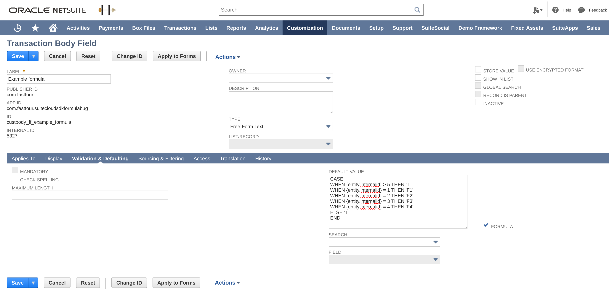
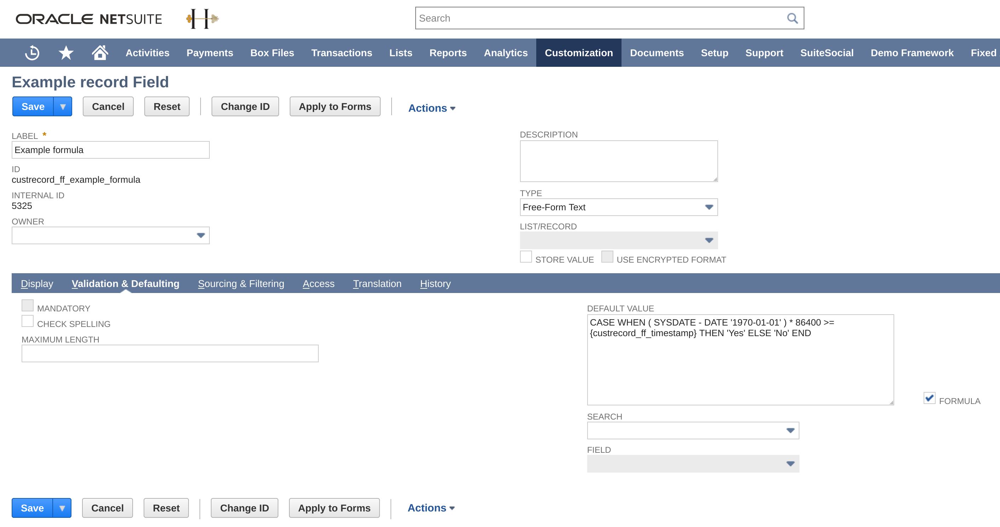

# suitecloud-sdk-formula-bug
This project contains a valid SDF project which contains only objects matching exactly how these were created in NetSuite and imported using SuiteCloud CLI for Node.js. It contains 2 objects: a transaction body field and a custom record. Both have a CASE formula in the default value of a field. This is valid in NetSuite, but this triggers an error when deploying to NetSuite using `suitecloud project:deploy`.





See `package.json` for available NPM scripts. The SDF objects were imported with the command `npm run import`. The validation passes both locally and against the server, you can verify this using `npm test`. When running `npm run deploy` (which runs `suitecloud project:deploy --validate`), the following error appears:

```
> suitecloud project:deploy --validate

The deployment process has encountered an error.
2020-08-14 04:54:31 (PST) Installation started
Info -- Account [(PRODUCTION) SDF Testing Account #2]
Info -- Publisher ID [com.fastfour]
Info -- SuiteApp [com.fastfour.suitecloudsdkformulabug (1.0.0)]
Info -- Framework Version [1.0]
Validate manifest -- Success
Validate deploy file -- Success
Validate objects -- Success
Validate files -- Success
Validate folders -- Success
Validate translation imports -- Success
Validate preferences -- Success
Validate flags -- Success
Validate account settings -- Success
Validate Custom Objects against the Account -- Success
Validate file cabinet items against the account -- Success
Validate translation imports against the account -- Success
Info -- Current installed version [1.0.0]
Begin deployment -- com.fastfour.suitecloudsdkformulabug (1.0.0)
Update object -- custbody_ff_example_formula (transactionbodycustomfield)
*** ERROR ***

An error occurred during custom object update.
File: ~/Objects/custbody_ff_example_formula.xml
Object: custbody_ff_example_formula (transactionbodycustomfield)
2020-08-14 04:54:31 (PST) Installation FAILED (0 minutes 1 second)
```

And also when only deploying the custom record, then likewise:

```
> suitecloud project:deploy --validate

The deployment process has encountered an error.
2020-08-14 04:06:45 (PST) Installation started
Info -- Account [(PRODUCTION) SDF Testing Account #2]
Info -- Publisher ID [com.fastfour]
Info -- SuiteApp [com.fastfour.suitecloudsdkformulabug (1.0.0)]
Info -- Framework Version [1.0]
Validate manifest -- Success
Validate deploy file -- Success
Validate objects -- Success
Validate files -- Success
Validate folders -- Success
Validate translation imports -- Success
Validate preferences -- Success
Validate flags -- Success
Validate account settings -- Success
Validate Custom Objects against the Account -- Success
Validate file cabinet items against the account -- Success
Validate translation imports against the account -- Success
Info -- Current installed version [1.0.0]
Begin deployment -- com.fastfour.suitecloudsdkformulabug (1.0.0)
Update object -- customrecord_ff_example_record (customrecordtype)
Update object -- customrecord_ff_example_record.custrecord_ff_example_formula (customrecordcustomfield)
*** ERROR ***

An error occurred during custom object update.
File: ~/Objects/customrecord_ff_example_record.xml
Object: customrecord_ff_example_record.custrecord_ff_example_formula (customrecordcustomfield)
2020-08-14 04:06:45 (PST) Installation FAILED (0 minutes 1 second)
```

# How to reproduce
* Checkout this git repository.
* Open a command line terminal and change directory to `./com.fastfour.suitecloudsdkformulabug/`.
* Run `npm install`
* Run `suitecloud account:setup -i` to point SuiteCloud CLI to a NetSuite account to which you have access.
* Run `npm test` to make sure the project is able to validate locally and against the target account. This command should succeed okay.
* Run `npm run deploy` to trigger the error.

The problem seems to be specific to fields which have a CASE formula in its default value. This error cannot be reproduced by other kind of default values (i.e. if you remove the CASE formula or replace it with a different default value which does not depend on CASE, it works okay).